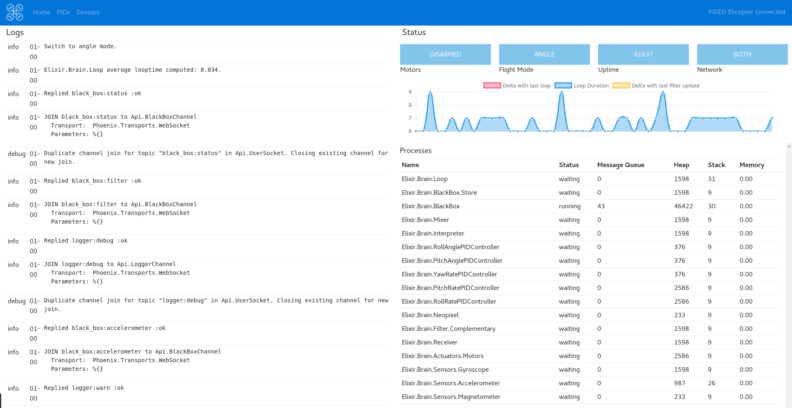
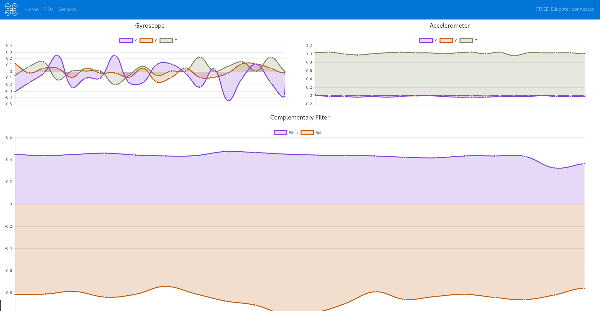
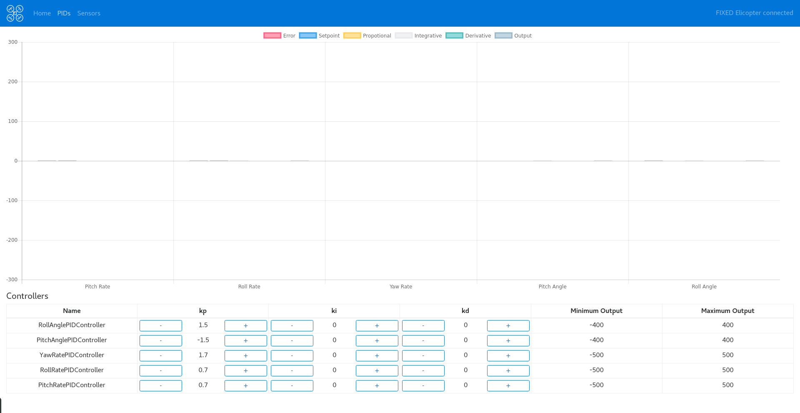

=========

Elicopter Ground Station is the control center for the [Elicopter Core](https://github.com/elicopter/core) flight controller.

> Note: Elicopter Ground Station is still under heavy development.

## Screenschots

* Dasboard



* Sensors



* PID Tuning



## Develop

* Install dependencies:
```
npm install -g electron
npm install -g angular-cli
npm install
```

* Start the development server:
```
npm start
```

## Contributing

Please read [CONTRIBUTING.md](https://github.com/elicopter/elicopter/blob/master/CONTRIBUTING.md) for details on our code of conduct, and the process for submitting pull requests to us.

## License

This project is licensed under the MIT License - see the [LICENSE.md](https://github.com/elicopter/elicopter/blob/master/LICENSE.md) file for details.
